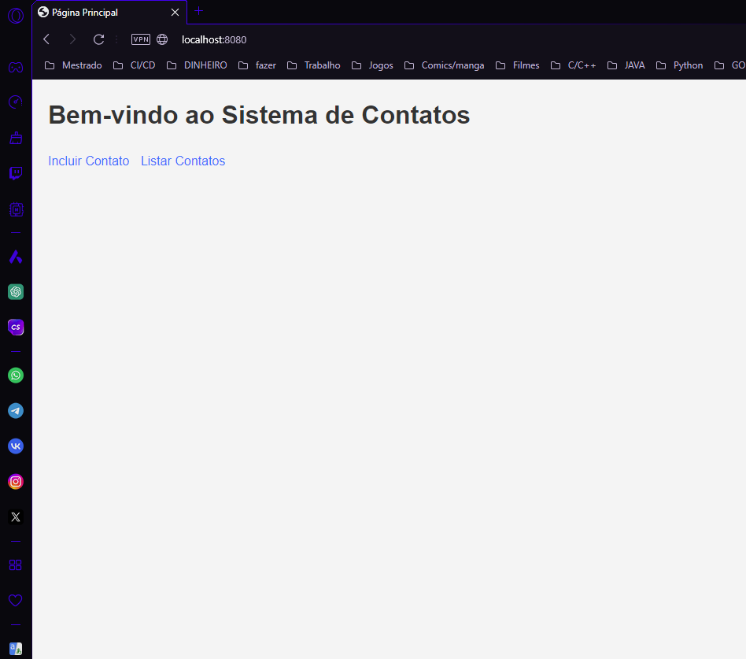
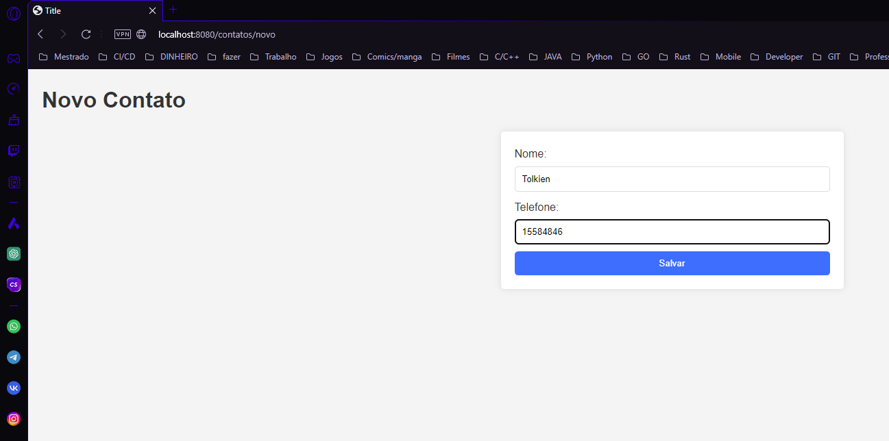
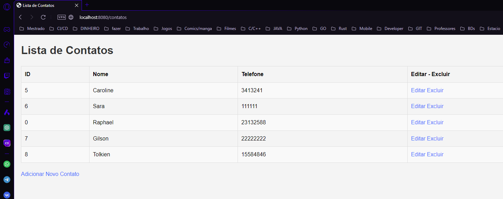
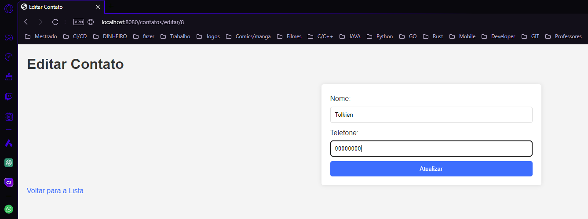
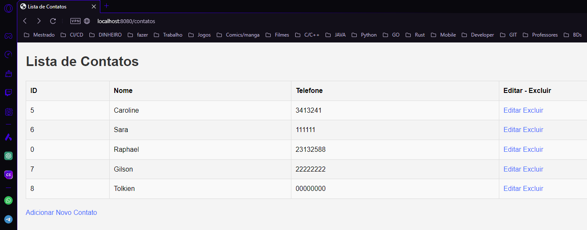

## Exemplos anti copia 🕵️‍♂️
# Gerenciamento de Contatos com Spring Boot

<p>Este é um exemplo simples de uma aplicação Spring Boot para gerenciamento de contatos. O objetivo deste projeto é demonstrar como criar, ler, atualizar e deletar (CRUD) contatos em uma aplicação web.<b><u>Ele contém propositalmente algumas falhas e áreas de melhoria, incentivando os alunos a corrigir e aprimorar o código, para seu projeto de extensão e não apenas copie.</b></u></p>

## Funcionalidades

- Listar todos os contatos
- Adicionar um novo contato
- Editar um contato existente
- Excluir um contato

## Tecnologias Utilizadas

- Java 17
- Spring Boot 2.7.x
- Spring Data JPA
- PostgreSQL
- JSP (JavaServer Pages)
- Apache Tomcat (embutido)

## Requisitos

- JDK 17 ou superior
- Maven 3.6.0 ou superior
- PostgreSQL

## Configuração do Banco de Dados

Certifique-se de que você tenha o PostgreSQL instalado e em execução. Crie um banco de dados chamado `contatosdb` e ajuste as configurações no arquivo `application.properties` conforme necessário:

```properties
spring.datasource.url=jdbc:postgresql://localhost:5432/contatosdb
spring.datasource.username=seu_usuario
spring.datasource.password=sua_senha
spring.jpa.hibernate.ddl-auto=update
spring.jpa.show-sql=true
spring.jpa.properties.hibernate.dialect=org.hibernate.dialect.PostgreSQLDialect
```

## Estrutura do Projeto
```
gerenciamento-contatos/
├── src/
│   ├── main/
│   │   ├── java/
│   │   │   └── com/
│   │   │       └── aula2024/
│   │   │           └── poo_2024_final/
│   │   │               ├── controller/
│   │   │               │   └── ContatoController.java
│   │   │               ├── model/
│   │   │               │   └── Contato.java
│   │   │               ├── repository/
│   │   │               │   └── ContatoRepository.java
│   │   │               └── service/
│   │   │                   └── ContatoService.java
│   │   ├── resources/
│   │   │   ├── application.properties
│   │   │   └── templates/
│   │   └── webapp/
│   │       └── WEB-INF/
│   │           ├── jsp/
│   │           │   ├── editarContato.jsp
│   │           │   ├── listarContatos.jsp
│   │           │   └── novoContato.jsp
│   │           └── web.xml
│   └── test/
│       └── java/
│           └── com/
│               └── aula2024/
│                   └── poo_2024_final/
│                       └── ContatoServiceTests.java
├── .gitignore
├── pom.xml
└── README.md
```

## Descrição da Estrutura

Diretórios e Arquivos
- src/main/java/com/aula2024/poo_2024_final/: Contém os pacotes principais do código Java.

  - controller/: Contém a classe ContatoController.java, que gerencia as requisições HTTP.
  
  - model/: Contém a classe Contato.java, que representa a entidade de contato.
  
  - repository/: Contém a interface ContatoRepository.java, que fornece métodos para operações de banco de dados.
  
  - service/: Contém a classe ContatoService.java, que implementa a lógica de negócio.

- src/main/resources/: Contém recursos de configuração e templates.

  - application.properties: Arquivo de configuração do Spring Boot.

- src/main/webapp/WEB-INF/: Contém configurações específicas da web e JSPs.

  - jsp/: Contém os arquivos JSP usados para a visualização.
  
    - editarContato.jsp: Formulário para editar um contato.
    
    - listarContatos.jsp: Lista todos os contatos.
    
    - novoContato.jsp: Formulário para adicionar um novo contato.
    
  - web.xml: Arquivo de configuração do servlet.
  
- src/test/java/com/aula2024/poo_2024_final/: Contém testes para o projeto.

  - ContatoServiceTests.java: Classe de teste para ContatoService.
  
- .gitignore: Arquivo que especifica arquivos e diretórios a serem ignorados pelo Git.

- pom.xml: Arquivo de configuração do Maven que define dependências e plugins do projeto.

- README.md: Documentação do projeto.

## Como Navegar na Estrutura
- Controller: Gerencia a lógica de rotas e endpoints.
- Model: Representa as entidades do banco de dados.
- Repository: Gerencia operações de persistência.
- Service: Implementa a lógica de negócios.
- Templates/JSP: Contêm a interface do usuário para interação com a aplicação.

Essa estrutura modulariza o projeto, facilitando a manutenção e a escalabilidade.

## Executando a Aplicação
1. Clone o repositório para a sua máquina local.
2. Configure o banco de dados PostgreSQL conforme mencionado acima.

## Telas exemplo:










